# EcoSafe AI
> **Forest Fire Detection & Intelligent Risk Analysis System**

EcoSafe AI is a state-of-the-art, full-stack application designed to detect forest fires in real-time using custom Machine Learning models and provide intelligent threat analysis. By combining a high-performance **FastAPI (Python)** backend running a specialized **TensorFlow Lite** model with a premium, interactive **Java Android mobile client**, EcoSafe AI empowers tourists, foresters, and environmentalists to scan forest terrains, identify fire outbreaks, analyze visual risk metrics, and report incidents instantly to emergency departments.

---

## 📋 Table of Contents
- [About the App](#-about-the-app)
- [App Screenshots](#-app-screenshots)
- [Key Features](#-key-features)
- [Technologies Used](#-technologies-used)
- [APK Download](#-apk-download)
- [How to Install the APK](#-how-to-install-the-apk)
- [How to Run the Project](#-how-to-run-the-project)
- [Privacy Policy](#-privacy-policy)
- [Future Enhancements](#-future-enhancements)
- [Developed By](#-developed-by)

---

## About the App
EcoSafe AI addresses the critical problem of rapid wildfire escalation through early visual detection and automated geo-reporting. 
* **What it is:** A comprehensive forest fire diagnostics and risk evaluation application powered by local TensorFlow Lite classification models.
* **Who can use it:** Tourists, hikers, forest authorities, researchers, and local residents inhabiting regions vulnerable to forest fire hazards.
* **Problem it solves:** Wildfires often spread undetected in remote forest regions due to delayed reporting. EcoSafe AI solves this by enabling instant, on-site image analysis, generating telemetry-rich fire reports (complete with GPS coordinates and confidence scores), and mapping fire activity.
* **Main features:** Real-time CameraX scanning, automated SQLite database synchronization, dynamic interactive data visualization charts, hybrid map tracking with fire threat buffers, a comprehensive local directory of vulnerable forests, and a one-tap emergency calling & location sharing suite.

---

## 📱 App Screenshots

### Onboarding & Permissions

| Splash Screen | Welcome Screen | Location Permission | Camera Permission |
| :---: | :---: | :---: | :---: |
| 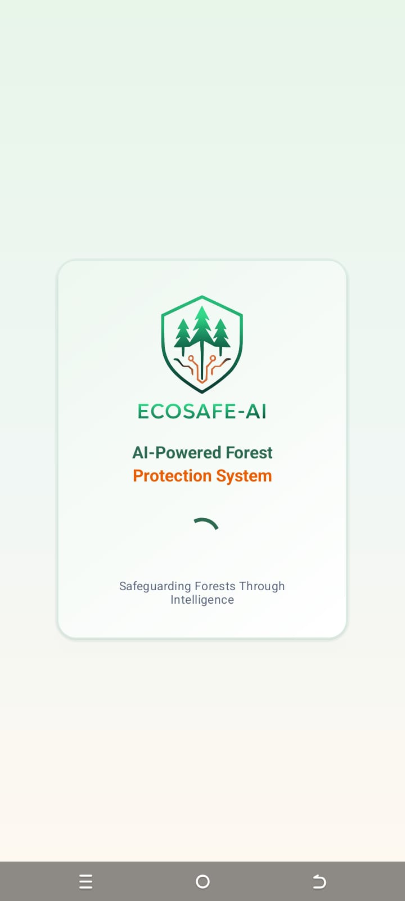 |  | 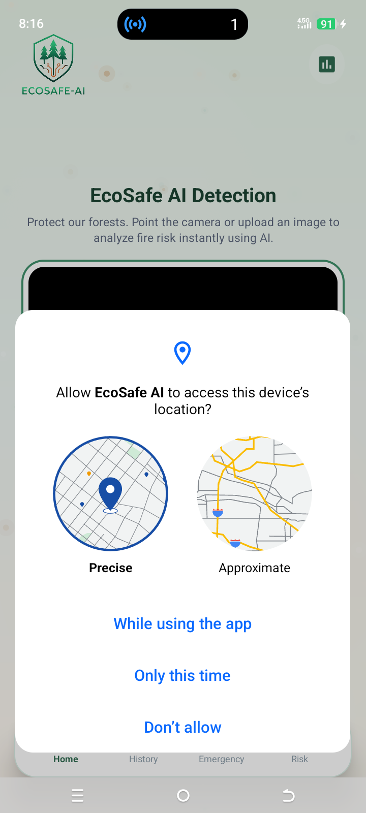 | 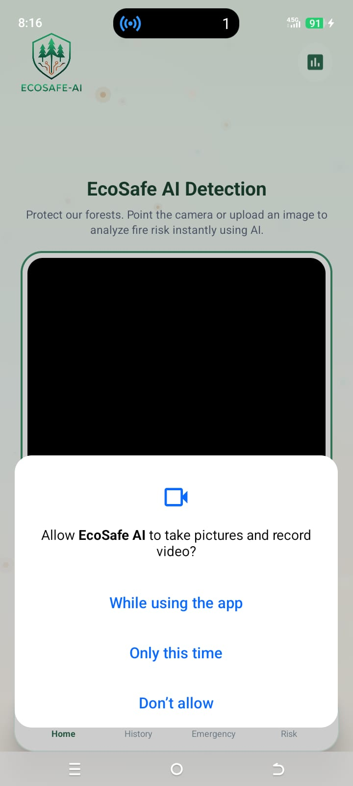 |

### AI Fire Detection

| Detection | Detection Result | Detection Result | Detection Result | Detection Result |
| :---: | :---: | :---: | :---: | :---: |
| 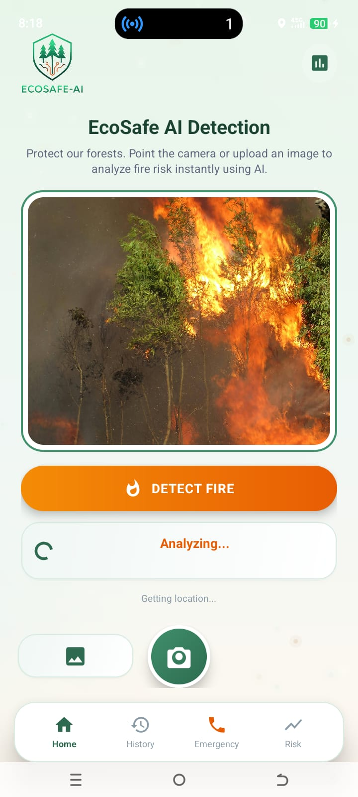 | 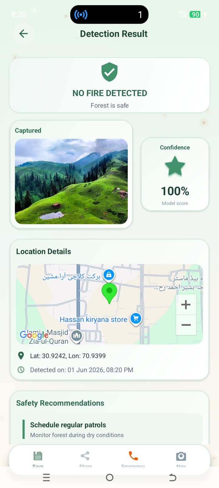 | 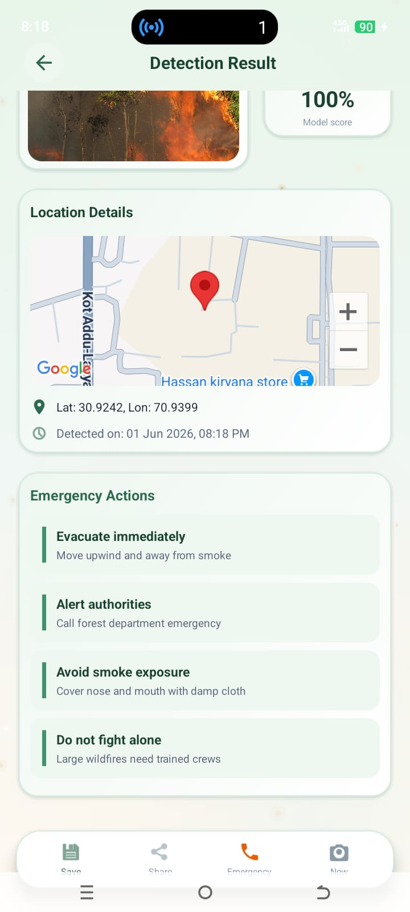 | 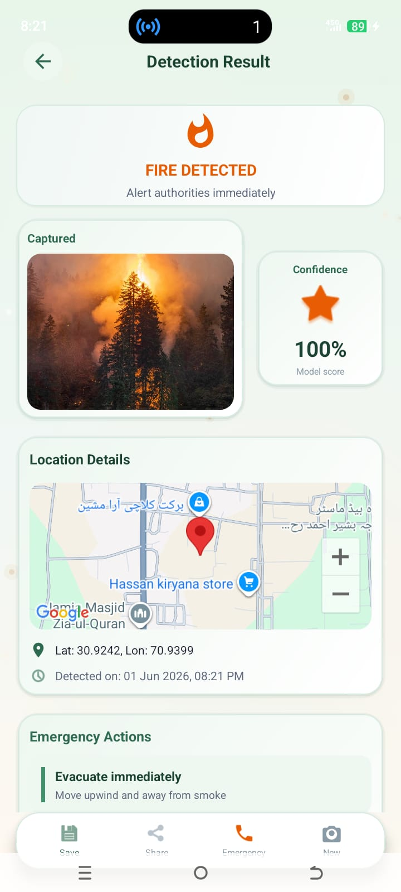 | 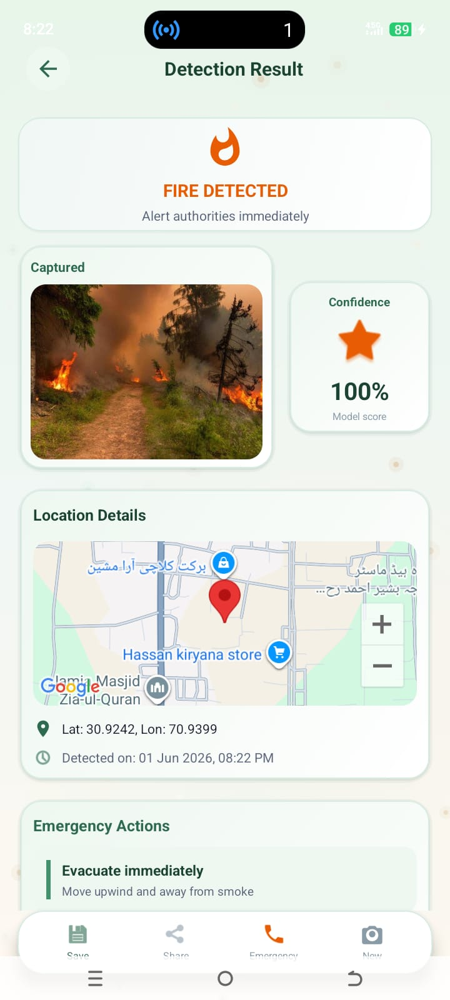 |

### Incident Monitoring

| Incident Details | Incident Details |
| :---: | :---: |
| 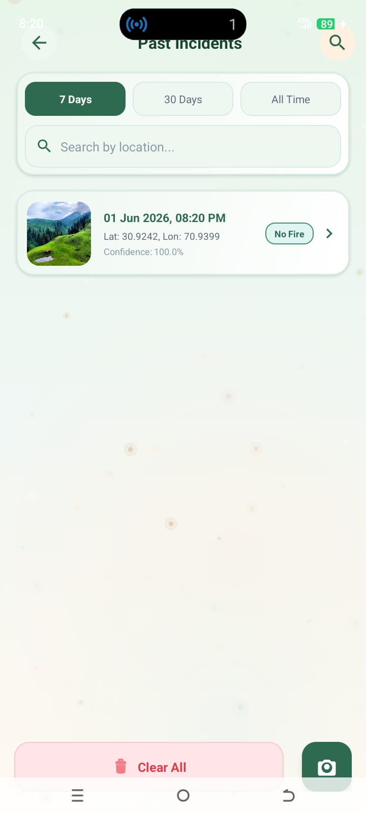 | 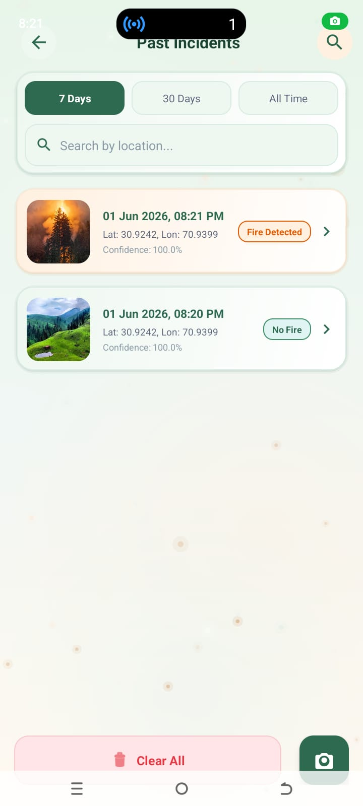 |

### Risk Analysis & Dashboard

| Risk Analysis | Dashboard | Risk Analysis |
| :---: | :---: | :---: |
| 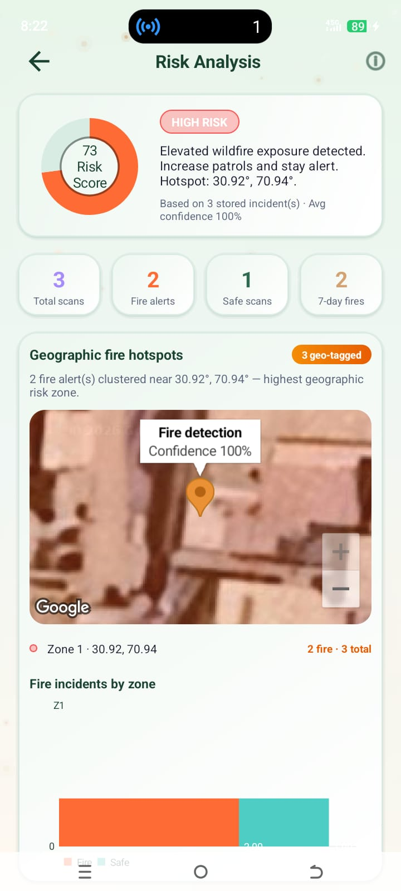 | 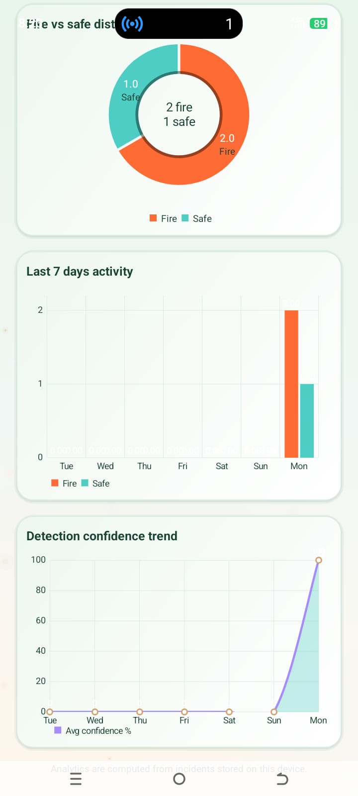 | 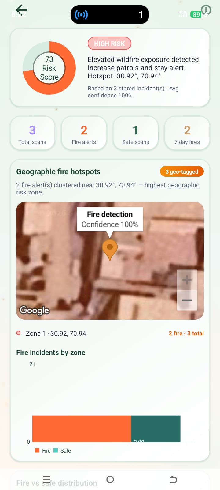 |

### Emergency Response

| Emergency Portal |
| :---: |
| 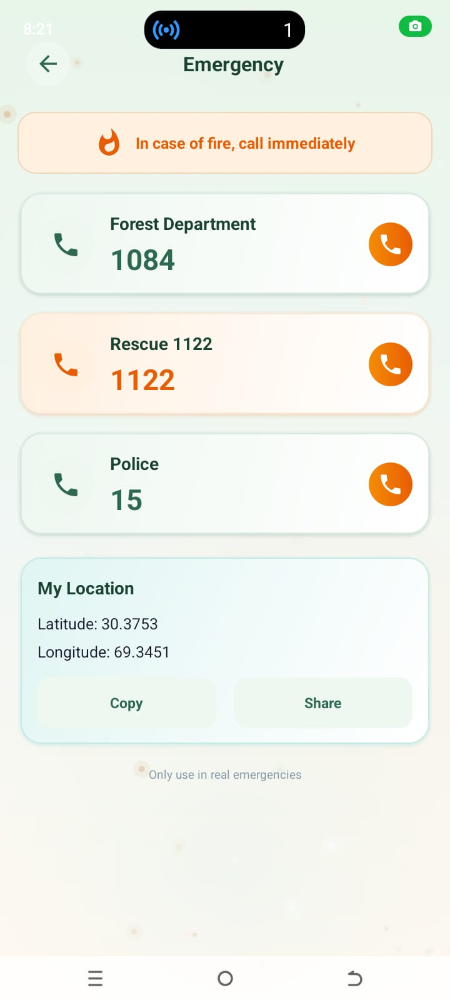 |

### Forest Intelligence

| High-Risk Forests | Medium-Risk Forests | Forest Information |
| :---: | :---: | :---: |
| 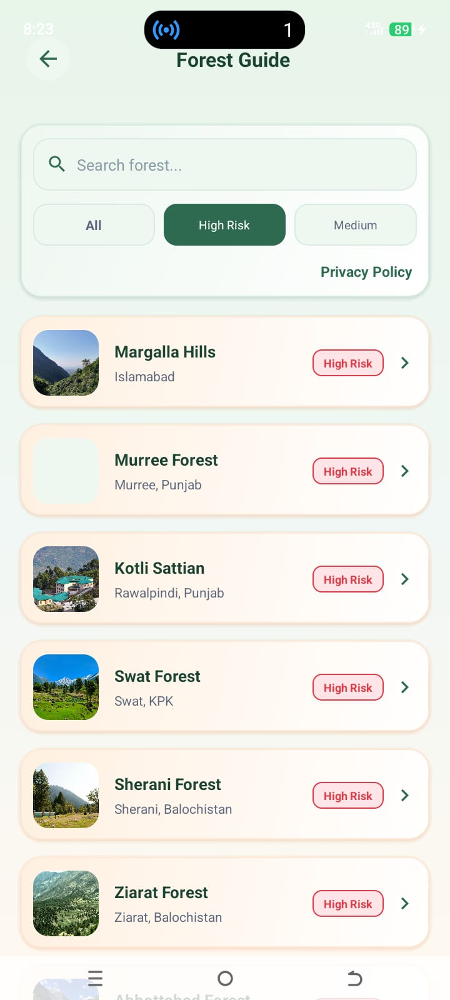 | 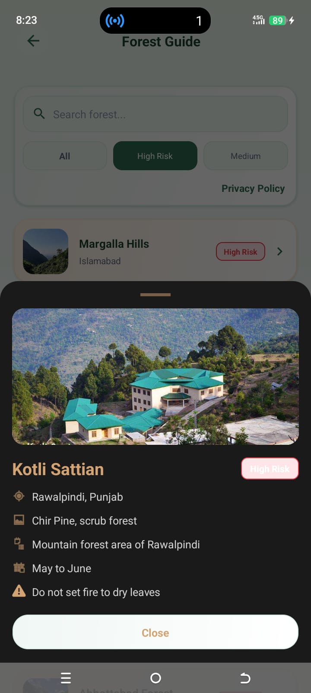 | 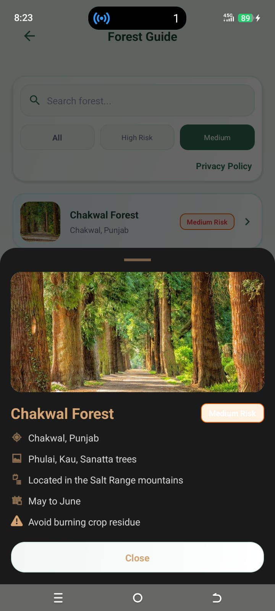 |

## Key Features

### 📸 1. Intelligent Real-Time Fire Scan
* **CameraX Integration:** Capture live images directly within the app using a high-performance, low-latency camera interface, or select photos from your device gallery.
* **Instant ML Diagnostics:** Upload captured images to the FastAPI server for binary classification (Fire vs. Safe Scan) processed via a specialized **TensorFlow Lite (`f.tflite`)** model.
* **Auditory Alarms:** Triggers a looping high-volume alert sound locally on the device immediately upon detecting fire to alert the user of immediate danger.

### 📊 2. Dynamic Risk Analytics Dashboard
* **Dynamic Threat Gauge:** Automatically evaluates fire threat level (LOW, MEDIUM, HIGH) as a gauge visualizer based on historical local log statistics.
* **Rich Data Visualization:** Uses interactive charts (powered by `MPAndroidChart`) to render:
  - **Fire vs. Safe Distribution:** Pie Chart depicting the proportion of fire outbreaks against safe scans.
  - **7-Day Scan Activity:** Bar Chart mapping daily diagnostic frequency.
  - **Detection Confidence Trend:** Line Chart tracking model classification confidence scores.
  - **Incident Distribution by Zone:** Horizontal Bar Chart representing fire outbreaks grouped by geographical sectors.

### 🗺️ 3. Interactive Threat Map (Google Maps)
* **Hybrid Map Visualization:** Integrates Google Maps Hybrid View to trace all local scans.
* **Visual Geo-tagging:** Places color-coded markers on coordinates where scans occurred—Orange markers represent verified fire outbreaks, and Green markers denote verified safe scans.
* **Threat Buffer Rings:** Dynamically renders translucent orange threat circles (heat zones) around clustered fire locations, where the circle's radius expands as more fires are logged in that hotspot.

### 📖 4. Vulnerable Forest Safety Directory
* **National Forest Profiles:** Comprehensive database of vulnerable forest areas in Pakistan (Margalla Hills, Murree Forest, Swat Forest, Ziarat Forest, Kotli Sattian, Abbottabad, and more).
* **Vegetation & Fire Season Profiles:** Displays distinct details for each forest, including local tree varieties (Chir Pine, Deodar, Oak), peak fire risk months (April-June), and ecological details.
* **Actionable Safety Guides:** Provides hikers, campers, and locals with specialized safety precautions to prevent accidental wildfire ignitions.
* **Bottom Sheet Modals:** Interactive, animated card-based modals to present comprehensive, beautifully organized forest summaries.

### 🚨 5. Instant Emergency Portal
* **Hotline Dispatcher:** Speed-dial buttons to instantly call national emergency response teams (Rescue 1122, Police 15, Forest Department 1084).
* **Telemetry Sharing:** Single-click utility to copy current precise GPS coordinates (Latitude & Longitude) or share a direct Google Maps location URL via messaging/social apps.

### 💾 6. Offline-First & Automatic Cloud Sync
* **Local Database Store:** Logs all diagnostics to a local SQLite database (`incidents.db`) to ensure the app is fully functional in remote forest regions without internet connectivity.
* **Dynamic Synchronizer:** Connects to the FastAPI backend to synchronize local data with the cloud server's database (`forest_fire.db`), ensuring records are unified across channels once internet access is restored.
* **Interactive Logs Management:** Swipe-to-delete gestures to dismiss records individually, filter logs by timeframe (7 Days, 30 Days, All), search by coordinate ranges, or perform secure local/cloud database clearing (admin authenticated).

---

## 🛠️ Technologies Used

### 📱 Android Mobile Client (Frontend)
* **Programming Language:** Java ☕
* **Development Environment:** Android Studio
* **Layout Design:** Modern XML Layouts with premium glassmorphic cards and springy micro-animations (`OvershootInterpolator`)
* **Camera Interface:** Jetpack CameraX API
* **Location & Geocoding:** Google Play Services FusedLocationProviderClient API
* **Interactive Mapping:** Google Maps SDK (Hybrid View type)
* **Data Visualization:** MPAndroidChart Library
* **Networking & API Client:** OkHttp3 & Retrofit 2 (JSON Parsing via Gson)
* **Runtime Permissions:** Dexter Permissions Library

### ⚙️ FastAPI Services (Backend)
* **Programming Language:** Python 🐍
* **API Framework:** FastAPI (High performance, asynchronous endpoints)
* **Machine Learning Engine:** TensorFlow Lite (`interpreter` interface running custom trained model `f.tflite`)
* **Data Management:** SQLite3 Database (`forest_fire.db` with incidents, users, and pending synchronization tables)
* **Image Processing:** Pillow (PIL) & NumPy
* **ASGI Server:** Uvicorn
* **Middleware:** CORS Cross-Origin Resource Sharing (for seamless connection to Android mobile clients)

---

## APK Download
The compiled debug APK is located in the build directory after compilation:

[Download EcoSafe AI Debug APK](file:///e:/EcoSafe_Local/EcoSafe%20AI/app/build/outputs/apk/debug/app-debug.apk)

---

## 📲 How to Install the APK
1. **Download the APK:** Click the link above to download the `EcoSafe_AI.apk` file.
2. **Transfer to Device:** Copy the downloaded APK to your Android smartphone (if downloaded on PC).
3. **Enable Unknown Sources:** Go to `Settings > Security` (or `Apps > Special Access`) and allow installation from **Unknown Sources**.
4. **Install & Launch:** Open your device's File Manager, tap on the APK file, click **Install**, and launch **EcoSafe AI**!

---

## How to Run the Project

### 🖥️ 1. Setting Up the FastAPI Backend Server
The FastAPI backend serves the TensorFlow Lite classification model and keeps track of reported incidents.

#### Prerequisites
* Python 3.9 or higher installed
* SQLite3 installed

#### Steps
1. Navigate to the `backend` folder:
   ```bash
   cd backend
   ```
2. Install the required Python dependencies:
   ```bash
   pip install fastapi uvicorn tensorflow numpy pillow requests
   ```
3. Ensure the TensorFlow Lite model file (`f.tflite`) and the alert sound (`alarm.wav`) are placed in the `backend/` directory.
4. Launch the FastAPI server:
   ```bash
   python main.py
   ```
5. The server will start running locally at: `http://localhost:8000`
   * View the interactive OpenAPI documentation at: `http://localhost:8000/docs`
   * Check health status: `http://localhost:8000/health`

> [!NOTE]
> Ensure that your computer and Android device are connected to the same Wi-Fi network. You do not need to modify any Java files to set the IP address; the mobile application features a dynamic configuration screen where you can save your current server URL at runtime.

---

### 📱 2. Running the Android Application in Android Studio
1. Open **Android Studio**.
2. Select **Open an Existing Project** and choose the `EcoSafe AI` directory.
3. Wait for the IDE to finish indexing and **Sync Gradle files**.
4. Configure your **Google Maps API Key** inside `app/src/main/AndroidManifest.xml` at:
   ```xml
   <meta-data
       android:name="com.google.android.geo.API_KEY"
       android:value="API_KEY" />
   ```
5. Configure the Backend URL dynamically: You do not need to modify any Java source code. Simply install the APK, tap the Settings (Gear) icon in the top-right corner of the application's Home Screen, enter your computer's local IP address (for example, 192.168.1.100:8000), and tap Save. The URL will be stored securely in SharedPreferences.
6. Connect an Android emulator or a physical Android smartphone with USB Debugging enabled.
7. Click the **Run** button (Green Play Icon) in Android Studio to build, install, and execute the app on your device!

---

## 🔒 Privacy Policy
EcoSafe AI values user privacy. The application accesses device location and camera exclusively to detect and report environmental wildfire threats. No personal datasets are shared with unverified external third-party servers.

View our official, host-published privacy policy:
🔗 [**View Published Privacy Policy**](https://ecosafe-privacy-police.netlify.app/)

---

## Future Enhancements
- **Push Notification Alerts:** Implement Firebase Cloud Messaging (FCM) to instantly alert residents within a 5km radius of a verified forest fire.
- **Deep Meteorological Risk Forecasting:** Integrate real-time weather APIs to factor wind speed, air humidity, and temperature into the local risk score calculations.
- **Advanced Admin Management Portal:** Develop a web-based administration panel to view heatmaps, dispatch wildfire response units, and resolve reported incidents.
- **On-Device Offline Inference:** Embed the TensorFlow Lite classification model directly into the Android mobile app using ML Kit or TensorFlow Lite Support Library to enable offline fire classification when the server is unreachable.

---

## 👩‍💻 Developed By
* **Developer Name:** Alina Liaquat
* **GitHub Profile:** [@precious-05](https://github.com/precious-05)
* **Contact Email:** [alina.insights@gmail.com](mailto:alina.insights@gmail.com)
* **Class & Semester:** *BS Computer Science - 6th Semester*
* **Department:** *Department of Computer Science*
* **LinkedIn Profile:** *www.linkedin.com/in/alina-liaquat-779347325*

---
*EcoSafe AI - Protecting our forests, preserving our future*
